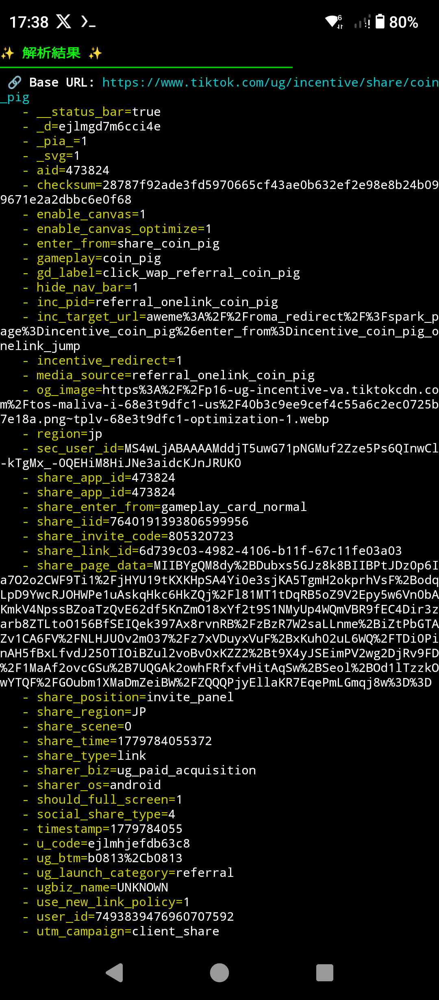

## tiktoklite-url-check
これを使用すると
招待する側のメタ情報が見やすく表示されます。

##[解説]
招待する側のクエリパラメータ(メタ情報)を用意
↓
インストールボタンをタップ
↓
招待される側のメタ情報を掛け合わせる
↓
内部プライベートAPI(エンドポイント)にぶつける
↓
招待判定

##  動作環境・技術スタック (Prerequisites)
- **言語/フレームワーク**: JavaScript
- **対応ブラウザ / OS**: Termuxで動作確認

##  導入方法 (Getting Started)
Nodejsの場合
```bash
# クローンしてインストールする場合のコマンド例
pkg install nodejs npm　#(Termuxでの例。OSごとにインストール方法が違います。)
git clone https://github.com/Felsaspalt/Github-Libraries-GeneratedDates/
cd tiktoklite-urlcheck
node tiktoklite-urlcheck3.js 調べたい招待url
```

## 💡 使い方 (Usage)
コマンドラインで出力を表示

## 🤝 貢献方法 (Contributing)
バグ報告やプルリクエスト（PR）を受け付けます

## 📜 ライセンス (License)

